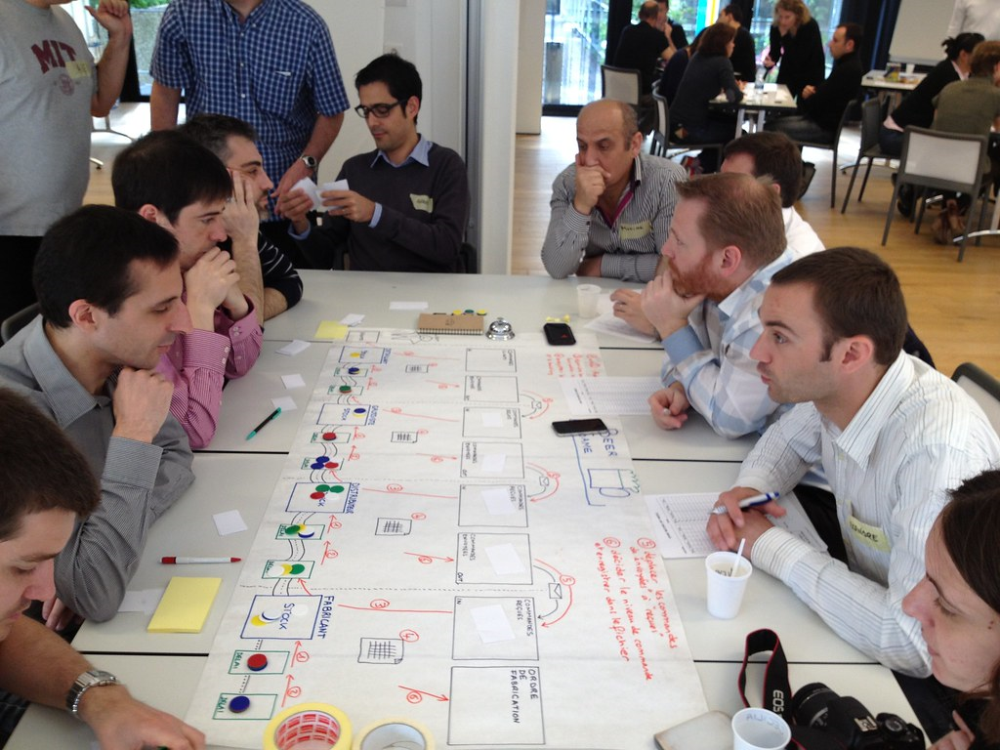

[](https://travis-ci.org/fhernanb/beergame)
[](https://cran.r-project.org/package=beergame)
[](https://cran.r-project.org/package=beergame) 

# beergame

beergame is a package that contains useful functions to replicate the famous Beer Game.



You can visit the [package website](https://fhernanb.github.io/beergame) to explore the vignettes (articles) and function reference. 

## Installation

Install latest development version from GitHub using the code given below:

```r
if (!require('devtools')) install.packages('devtools')
devtools::install_github('fhernanb/beergame', force=TRUE)
```